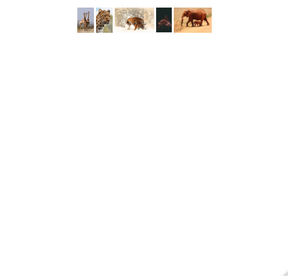
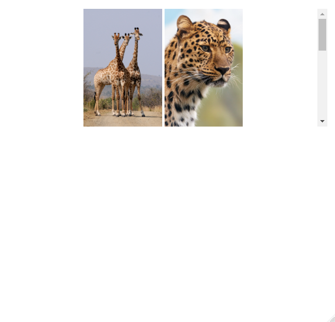

<!-- README.md is generated from README.Rmd. Please edit that file -->

```{r, include = FALSE}
knitr::opts_chunk$set(
  collapse = TRUE,
  comment = "#>",
  fig.path = "man/figures/README-",
  out.width = "100%"
)
library(webshot)
```

# lightbox2

Use the [lightbox2 javascript library](https://lokeshdhakar.com/projects/lightbox2/) to render image files in an `htmlwidget`.

## Installation

```r
devtools::install_github("fazetu/lightbox2")
```

## Examples

```{r}
library(lightbox2)
```

Get file paths to some image files.

```{r}
images <- example_images()
```

Note there is also `example_lightbox2()`.

These examples are **not** interactive, but demonstrate the different styling options available.

This R code chunk in R Markdown does **not** have `results='asis'`.

<!-- Webshot not working so just take manual screen captures for now -->

```{r, eval=FALSE}
lightbox2(images)
```


Change thumbnail size.

```{r, eval=FALSE}
lightbox2(images, thumbnailHeight = "50px", thumbnailWidth = "auto")
```



Change thumbnail alignment.

```{r, eval=FALSE}
lightbox2(images, thumbnailHeight = "50px", thumbnailWidth = "auto", thumbnailAlign = "left")
```


Make it so we get a scroll bar by adjusting thumbnail height and max height of the widget.

```{r, eval=FALSE}
lightbox2(images, thumbnailHeight = "200px", thumbnailWidth = "auto", maxHeight = "200px")
```



Adjust the size of the overall widget.

```{r, eval=FALSE}
lightbox2(images, width = "50%")
```


Don't center within the page.

```{r, eval=FALSE}
lightbox2(images, width = "50%", margin = "none")
```


